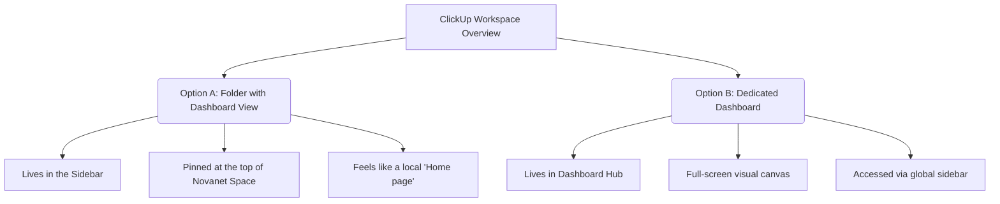
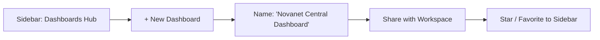

# Plan: ClickUp Dashboard Integration for Novanet Studio

This document outlines the research and provides a detailed, step-by-step implementation plan for creating a centralized **Dashboard-like view** in ClickUp. The goal is to collect all current activities across lists (such as *Lista A*, *Maximiza*, and *Agua Fría Coffee*) and display their status in an elegant, workspace-wide overview.

---

## 1. Research Findings & Strategic Recommendations

In ClickUp, there are two primary ways to create a shared "Dashboard" experience that functions as a project home or landing page:



### Option A: Folder called "Dashboard" with a Dashboard View (Recommended)
This approach creates a dedicated Folder (e.g., `00. Dashboard` or `🏠 Home`) in the **Novanet** space. Inside this folder, we create a **Dashboard View**. 

*   **Why this works best for Novanet:** It integrates directly into your existing Sidebar navigation. By naming it with a `00.` prefix or using a house emoji (`🏠`), it remains anchored at the very top of your Space, serving as a de-facto "Home page" or landing page for anyone opening the space.
*   **Data Aggregation:** Although the Dashboard lives in this new folder, each card (widget) on the dashboard can be customized to pull task data from **any** Space, Folder, or List in the Workspace (specifically, the *Cronograma de edición de videos* folder and its sub-lists).

### Option B: Dedicated Dashboard (Dashboards Hub)
This approach creates a standalone Dashboard via ClickUp's global **Dashboards Hub** (independent of any Space, Folder, or List).

*   **Why this works:** It is completely decoupled from your Space hierarchy. It is ideal for high-level workspace summaries, cross-space reports, or as a centralized, full-screen command center.
*   **Accessibility:** Since it is outside of any Space, it is managed through the global **Dashboards Hub**. To make it function as the "de-facto Home Page" of the workspace, you can share it with all members, and users can add it to their personal sidebar **Favorites** for single-click access.

---

## 2. Proposed Dashboard Layout & Widgets

To give team members a premium, comprehensive view of all video production and client activities, we propose a modular layout containing the following **Dashboard Cards (Widgets)**:

| Card / Widget Name | Type | Data Source (Location) | Purpose & Value |
| :--- | :--- | :--- | :--- |
| **📊 Global Status Distribution** | Pie / Bar Chart | `Novanet` Space (or specific lists) | Visualizes the share of tasks in each status (`to do`, `in progress`, `review`, `for approval`, `ready`). Quickly shows bottlenecks. |
| **🚀 Active Projects & Progress** | Portfolio / List | `Cronograma de edición de videos` Folder | Displays parent tasks (Projects) alongside a progress bar showing subtask completion percentage. |
| **📋 High-Priority Deliverables** | Task List | `Cronograma de edición de videos` + `Maximiza` | A clean list of tasks filtered to show only those with high priority, or those in `review` or `for approval` status. |
| **👥 Workload & Assignments** | Bar Chart / Workload | All production lists | Shows task counts distributed by assignee so team leads know who is over- or under-allocated. |
| **💬 Team Bulletin & Notes** | Text block / Chat | Local | A static area for announcements, links to guidelines (such as `GEMINI.md` or `PLAN.md`), and quick status updates. |

---

## 3. Step-by-Step Implementation Plans

### Implementation Route A: Local Folder View (Inside Novanet Space)

#### Step 1: Create the "Dashboard" Folder
1. Open your ClickUp Workspace and navigate to the **Novanet** Space.
2. Click the **+** icon next to the Space name in the sidebar and select **Folder**.
3. Name the folder **`00. Dashboard`** (or **`🏠 Home`** / **`📊 Dashboard`**).
4. Save the folder. This ensures it stays at the top of your sidebar list above other folders like *Cronograma de edición de videos*.

> [!NOTE]
> Since this folder is created purely to house the Dashboard view, you do not need to create any lists inside it. We will utilize the views bar at the folder level.

#### Step 2: Create and Set up the Dashboard View
1. Click on your newly created **`00. Dashboard`** folder in the sidebar.
2. In the views bar at the top of the screen, click **+ View**.
3. Select **Dashboard** from the list of available views.
4. Name the view **`Workspace Overview`** or **`Inicio`**.
5. Click **Add Dashboard**.

#### Step 3: Configure the Widgets (Cards)
For each widget you want to add, follow these steps:
1. Ensure the Dashboard is in **Edit Mode** (toggle in the upper right).
2. Click **+ Add card** in the top-right corner.
3. Select the card type (e.g., **Pie Chart** for status, or **Task List** for deliverables).
4. Open the card settings (cog icon ⚙️) and configure the **Location**:
   * Deselect the local `00. Dashboard` folder.
   * Select the **`Cronograma de edición de videos`** folder (including *Lista A*, *Maximiza*, and *Agua Fría Coffee*).
5. Customize filters (e.g., group by **Status**, or filter by **Priority = High**).
6. Click **Save** to place the card on your canvas. Arrange and resize cards to your liking.

#### Step 4: Share and Make It the Default Landing Page
To ensure everyone uses this as their main home:
1. **Pin the View:** Right-click the Dashboard view tab at the top of the folder and toggle **Pin view** to `ON`.
2. **Make it Default:** Right-click the Dashboard view tab, and select **Set as default view** (this makes it the first thing anyone sees when they click this folder).
3. **Favorite for Quick Sidebar Access:** Ask users to hover over the `00. Dashboard` folder (or the view itself) and click the **Star** icon to add it to their personal Sidebar Favorites, placing it directly under the global ClickUp Home.


### Implementation Route B: Standalone Dashboard (Outside Any Space - Recommended)

Creating the dashboard outside of any space decouples it from the workspace's folder/list structure and places it in the global **Dashboards Hub**, providing a full-screen canvas.



#### Step 1: Create the Dashboard in the Global Hub
1. On the left-hand global navigation bar in ClickUp, hover over or click on the **Dashboards** hub icon (represented by a speedometer/gauge icon).
2. In the upper-right corner of the Dashboards Hub, click **+ New Dashboard** (or click the simple **+** button).
3. Choose either a **Template** (e.g., "Simple Dashboard") or click **Create from scratch** for maximum flexibility.
4. Name the Dashboard **`Novanet Central Dashboard`** or **`🏠 Workspace Home`**.

#### Step 2: Share with the Entire Workspace (Crucial)
By default, new standalone dashboards are private to their creator. To make it the shared central hub:
1. Open the dashboard you just created.
2. In the top-right corner, click the **Share** button.
3. Under the workspace sharing settings, toggle the visibility to **"Share with Workspace"** or select the specific team/members who need access.
4. Set permission levels to **"Can view"** for general team members (and **"Full"** or **"Edit"** for project managers/admins who will maintain it).

#### Step 3: Configure Widgets to Pull Cross-Space Data
Since the dashboard lives in the global hub, it defaults to no data source. You must explicitly tell each widget where to get its data:
1. Click **+ Add Card** in the upper right.
2. Select your desired widget (e.g., *Task List*, *Pie Chart*, or *Portfolio*).
3. Under **Select Location** in the widget's settings modal, expand the Space list and check:
   * **Novanet Space** $\rightarrow$ **`Cronograma de edición de videos`** (and select *Lista A*, *Maximiza*, and *Agua Fría Coffee*).
   * *(Optional)* Any other client spaces/lists you wish to include in your global reporting.
4. Save the widget and resize it. Repeat for all 5 recommended cards outlined in Section 2.

#### Step 4: Make It Easily Accessible (How to behave like "Home")
Because this dashboard lives in the global Dashboards Hub rather than the standard Sidebar folders, you should use the following strategies to make it the central starting point for everyone:

*   **Strategy 1: Add to Sidebar Favorites (Highly Recommended)**
    Tell your team members to open the shared Dashboard and click the **Star icon** in the top-right corner. This will instantly pin the Dashboard to the **"Favorites"** section at the very top of their left-hand sidebar, right beneath the native ClickUp *Home* page. It is now accessible in a single click from anywhere in the app.
*   **Strategy 2: Add as a Resource Link in Space Overviews**
    Navigate to the **Novanet** Space. Click the **Overview** tab (the Space-level landing page). In the space description or resources section, paste the URL of the standalone Dashboard so anyone entering the space can easily find the main reporting hub.
*   **Strategy 3: Embed in a Shared ClickUp Doc**
    Create a shared ClickUp Doc called **`Novanet Command Center`** pinned to the sidebar. In this Doc, you can use ClickUp's native `/embed` command and paste the Dashboard's link. This embeds the entire live dashboard directly inside the document.

---

## 4. Visual Layout Mockup

Here is a conceptual mockup of how the completed dashboard view will look:

```
+----------------------------------------------------------------------------------+
|  🏠 00. Dashboard  >  [📊 Workspace Overview]   [📋 List]   [🗂️ Docs]             |
+----------------------------------------------------------------------------------+
|                                                                                  |
|  +---------------------------------------+  +---------------------------------+  |
|  | 📊 Status Distribution                |  | 🚀 Project Progress (Portfolio) |  |
|  |                                       |  |                                 |  |
|  |    ● To Do (35%)                      |  |  * Video Schedule v2  [▓▓▓░░] 60% |  |
|  |    ● In Progress (20%)                |  |  * Maximiza           [▓▓▓▓░] 80% |  |
|  |    ** For Approval (15%)               |  |  * Agua Fría Coffee   [▓░░░░] 20% |  |
|  |    ● Ready (30%)                      |  |                                 |  |
|  +---------------------------------------+  +---------------------------------+  |
|                                                                                  |
|  +----------------------------------------------------------------------------+  |
|  | 📋 Urgent Deliverables (For Approval & Review)                              |  |
|  |                                                                            |  |
|  |  [Task Name]                 [List]               [Assignee]    [Due Date] |  |
|  |  - Post Resumen              Maximiza             @john_doe     July 10    |  |
|  |  - Post 3 Profesora Morillo  Agua Fría Coffee     @jane_smith   July 12    |  |
|  +----------------------------------------------------------------------------+  |
|                                                                                  |
+----------------------------------------------------------------------------------+
```

---

## 5. Next Steps

> [!TIP]
> 1. Let's confirm if you'd like to proceed with **Option A** (Folder with Dashboard view) or if you prefer **Option B** (dedicated standalone Dashboard).
> 2. Once decided, I can draft exact settings, custom field mappings, or write a quick script/reference markdown if you need help auto-generating document-based layouts for other lists!
